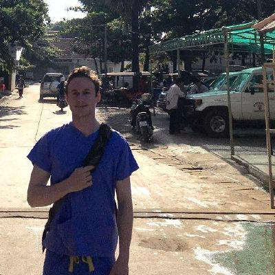

# Fergus Taylor 

[github.com/fergustaylor](https://github.com/fergustaylor)

[twitter.com/ferguswtaylor](https://twitter.com/ferguswtaylor)

**About Me:** My twitter bio says I'm a Glasgow medical student with interests in Global Surgery, C8H10N4O2, and skyscanner. That's fairly concise.

I've an interest in academic medicine, and have worked on a few projects as a student.
I'm interested now in learning how to do more data science using R. (Although I'm trying to learn Python, mostly for the Pi).

I tend to use private repositories on Github when I'm working on something, but ideally I'd like to make these more public - especially when using public datasets. So if there's something I can share, I do at least try to post explanations of what I'm working on here.
The projects below show some examples of work I'm interested in at the moment.

## [**Arran**](https://fergustaylor.github.io/Arran)
An example exercise mapping SIMD health data onto [Arran](https://www.google.co.uk/search?q=arran&oq=arran&aqs=chrome..69i57j69i60l3j69i65l2.2702j0j1&sourceid=chrome&ie=UTF-8).

