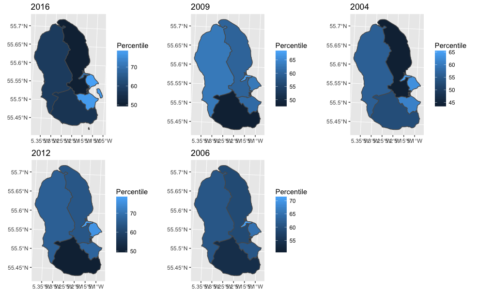

## [**15/09/17 - openprescribingR Plots**](https://fergustaylor.github.io/blog/post6)
Maps and maps.

## [**13/09/17 - openprescribingR UPDATE**](https://fergustaylor.github.io/blog/post5)
I created a new function for my package openprescribingR, which lets you search for the boundaries of a CCG, or location of a practice, by code. Returns GeoJSON.

## [**11/09/17 - openprescribingR**](https://fergustaylor.github.io/blog/post4)
I made a package for the first time, which lets me import data from the new openprescribing api directly into R.

## [**04/08/17 - Public Health Outcomes Framework**](https://fergustaylor.github.io/blog/post3)
Looking at the most recent update to Public Health England, 'Public Health Outcomes' August publication using the Fingertips data tool package.

## [**29/07/17 - Arran SIMD GIFs**](https://fergustaylor.github.io/blog/post2)
Practice with GGanimate and GGmaps, as well as an animation of leaflet maps.

## [**28/07/17 - Arran**](https://fergustaylor.github.io/Arran)
An example exercise mapping SIMD health data onto [Arran](https://fergustaylor.github.io/Arran).

